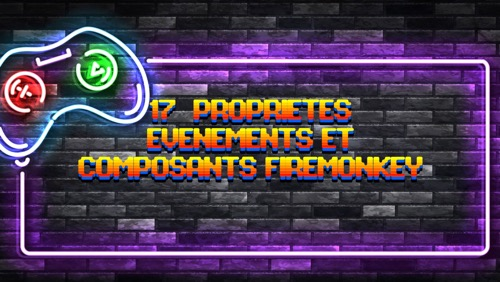
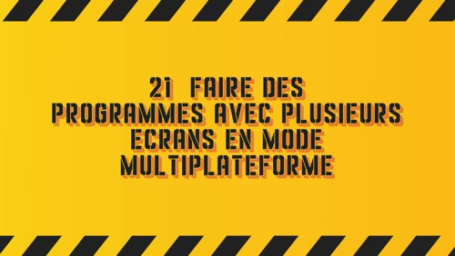

# Video Title Page Generator

[Cette page en français.](LISEZMOI.md)

This program generates images from a background image and a set of texts formatted with a graphic font.

It can be used to generate images for titling videos or slides for presentations.

This code repository contains a project developed in Object Pascal language under Delphi. You don't know what Delphi is and where to download it ? You'll learn more [on this web site](https://delphi-resources.developpeur-pascal.fr/).

## Generated sample pictures

## Talks and conferences

### Twitch

Follow my development streams of software, video games, mobile applications and websites on [my Twitch channel](https://www.twitch.tv/patrickpremartin) or as replays on [Serial Streameur](https://serialstreameur.fr) mostly in French.

## Install

To download this project you better should use "git" command but you also can download a ZIP from [its GitHub repository](https://github.com/DeveloppeurPascal/Video-Title-Page-Generator).

**Warning :** if the project has submodules dependencies they wont be in the ZIP file. You'll have to download them manually.

## Dependencies

This project depends on :

* [DeveloppeurPascal/librairies](https://github.com/DeveloppeurPascal/librairies) must be in sub folder ./lib-externes/librairies
* [DeveloppeurPascal/AboutDialog-Delphi-Component](https://github.com/DeveloppeurPascal/AboutDialog-Delphi-Component) must be in sub folder ./lib-externes/AboutDialog-Delphi-Component

## How to ask a new feature, report a bug or a security issue ?

If you want an answer from the project owner the best way to ask for a new feature or report a bug is to go to [the GitHub repository](https://github.com/DeveloppeurPascal/Video-Title-Page-Generator) and [open a new issue](https://github.com/DeveloppeurPascal/Video-Title-Page-Generator/issues).

If you found a security issue please don't report it publicly before a patch is available. Explain the case by [sending a private message to the author](https://developpeur-pascal.fr/nous-contacter.php).

You also can fork the repository and contribute by submitting pull requests if you want to help. Please read the [CONTRIBUTING.md](CONTRIBUTING.md) file.

## Dual licensing model

This project is distributed under [AGPL 3.0 or later](https://choosealicense.com/licenses/agpl-3.0/) license.

If you want to use it or a part of it in your projects but don't want to share the sources or don't want to distribute your project under the same license you can buy the right to use it under the [Apache License 2.0](https://choosealicense.com/licenses/apache-2.0/) or a dedicated license ([contact the author](https://developpeur-pascal.fr/nous-contacter.php) to explain your needs).

## Support the project and its author

If you think this project is useful and want to support it, please make a donation to [its author](https://github.com/DeveloppeurPascal). It will help to maintain the code and binaries.

You can use one of those services :

* [GitHub Sponsors](https://github.com/sponsors/DeveloppeurPascal)
* [Liberapay](https://liberapay.com/PatrickPremartin)
* [Patreon](https://www.patreon.com/patrickpremartin)
* [Paypal](https://www.paypal.com/paypalme/patrickpremartin)

or if you speack french you can [subscribe to Zone Abo](https://zone-abo.fr/nos-abonnements.php) on a monthly or yearly basis and get a lot of resources as videos and articles.
